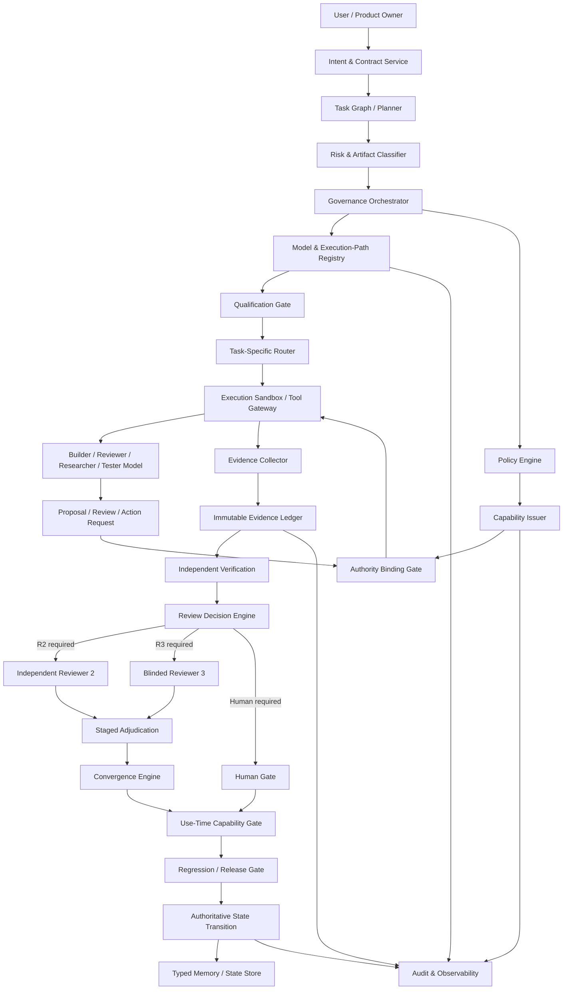

# Governed AI Development Platform — Target Architecture

Status: **Architecture Candidate / Experimental Evidence-Informed**

This document describes the target product architecture emerging from the governed-platform experiments. It is not a claim that every component is production-ready. Experimental modules remain evidence sources until promoted through their own validation gates.

## 1. Architectural objective

The platform must let capable AI models reason, review, code, test, browse, and operate tools without allowing any model to infer or manufacture consequential authority.

The governing sequence is:

**Diagnosis → Determine permissible artifact/action → Select qualified model → Issue scoped capability → Agent executes → Independent verification evidence → Approval/regression/release gate.**

Models are replaceable reasoning/execution components beneath the governance layer. More capable models reduce execution friction; they do not remove the need for external authority, evidence, or release gates.

## 2. Non-negotiable invariants

1. **Authority is external to the model.** A model may request, recommend, or claim scope; only the platform can issue effective authority.
2. **No model output directly mutates authoritative state.** Model output is proposal/evidence until a platform-owned gate accepts an action.
3. **Use-time authorization is mandatory.** A capability that was valid at routing/binding time must be revalidated immediately before consequential execution.
4. **Qualification is task-specific and path-specific.** Eligibility is not “best model”; it is bound to role + task class + provider + model + SKU + deployment/execution path + policy/privacy context.
5. **Runtime model/provider labels are metadata, not identity proof.** Provider-returned strings cannot be the sole authority for identity or qualification.
6. **Public benchmarks are discovery evidence only.** Production routing eligibility comes from retained internal qualification evidence.
7. **Workflow SUCCESS is operational state only.** It must never be interpreted as behavioral/scientific approval.
8. **Cross-model agreement is evidence only.** Agreement, majority, prestige, seniority, or reviewer confidence never creates authority.
9. **Protected truth and model-private reasoning stay outside reviewer context.** Reviewers receive only the context allowed for their stage.
10. **Evidence is immutable/tamper-evident and provenance-bound.** A later pass cannot erase a prior failure.
11. **Requirement ambiguity cannot receive automatic corrective authority.** It escalates to a human or an authorized requirements owner.
12. **Failover is not substitution.** A fallback path must itself be currently qualified for the same role/task/policy/privacy contract.

## 3. Logical architecture

## 4. Architecture planes

### 4.1 Intent and contract plane

Owns the authoritative interpretation of what is being requested and what constraints cannot silently change.

Components:
- Intent & Contract Service
- Requirement / invariant registry
- Artifact taxonomy
- Risk and materiality classifier
- Change-impact graph
- Human requirement-resolution gate

The model may help extract or propose requirements, but authoritative requirements are versioned platform state. A model cannot overwrite them without external authority.

### 4.2 Governance and orchestration plane

Owns workflow state, event acceptance, review escalation, completion rules, and state transitions.

Components:
- Governance Orchestrator / Governor
- Event continuation controller
- Review Decision Engine
- Convergence Engine
- Adjudication coordinator
- Manual/human gates
- Budget and retry policy

Authoritative events are authenticated, replay-protected, project/task/SHA-bound, and state-version checked before they can advance the workflow.

### 4.3 Authority and policy plane

This is the central trust boundary.

Components:
- Policy Engine
- Capability Issuer
- Authority Binding Gate
- Capability Store / epoch state
- Use-Time Execution Authority Gate
- Revocation service

A model response contains at most a **requested/claimed scope**. The platform computes **effective scope** from the externally issued capability. If the capability is `NONE`, effective authority remains empty even if the model asks for WRITE, RELEASE, tool execution, or changed artifacts.

Recommended capability classes:
- `NONE`
- `READ_CONTEXT`
- `PROPOSE_PATCH`
- `RUN_TESTS`
- `WRITE_SCOPED_ARTIFACT`
- `EXECUTE_SCOPED_TOOL`
- `REQUEST_EXTERNAL_ACTION`
- `RELEASE_CANDIDATE`

These are not flat trust levels. Each capability must also bind project, task, subject, action, artifact classes, policy epoch, capability epoch, expiry, and revocation status.

### 4.4 Model qualification and routing plane

The registry must distinguish **reasoning qualification** from **operational eligibility**.

A route identity should include at least:
- provider
- model
- SKU / concrete model offering
- deployment/execution path
- role (Builder, R1, R2, R3/Judge, Researcher, Security Reviewer, Tester, Adjudicator candidate)
- task class
- risk tier
- privacy class
- policy hash/version
- qualification ID/ref
- qualification epoch and expiry
- foundation lineage / independence metadata
- supported context/tool capabilities
- latency/cost observations
- operational availability
- quota/capacity state
- execution-path provenance class

`execution_path` must be strong enough to detect account/project/routing differences that can change quota, privacy, routing, or behavior. Raw credentials must never be stored in evidence. A different account/path is not automatically interchangeable even when provider + model strings match.

Routing decision:

`eligible = qualification_current ∧ policy_compatible ∧ privacy_compatible ∧ path_current ∧ operationally_available`

A qualified-but-quota-exhausted model remains reasoning-qualified while being temporarily operationally ineligible.

### 4.5 Execution plane

Components:
- Provider adapters
- Code/terminal/browser/tool gateways
- Sandboxed workspaces
- Network policy
- Repository/branch adapters
- Test runners
- Artifact writers

The execution plane never receives broad ambient authority. It receives a scoped capability token/envelope. Consequential calls pass through the use-time gate immediately before execution.

An autonomous agent may perform many reasoning/tool steps inside a granted scope, but crossing action/artifact/project/task boundaries requires new platform authority.

### 4.6 Evidence and verification plane

Components:
- Evidence Collector
- Tamper-evident Evidence Ledger
- Test/CI evidence normalizers
- Static/dynamic/security verification adapters
- Independent reviewer evidence
- Provenance validator
- Evidence retention/invalidation service

Evidence records are bound to:
- evidence ID
- project ID
- task ID
- execution SHA/artifact digest
- evidence type
- content hash
- provider/model/path qualification lineage when applicable
- capability/policy epoch when applicable
- timestamp/sequence
- previous record hash

Evidence becomes inadmissible when its binding is stale: changed artifact, changed policy, revoked capability, changed qualification path, changed task/project, or invalidated evidence epoch.

### 4.7 Review and adjudication plane

The platform controls whether additional review is required; models cannot opt themselves out of policy-required review.

Review sequence:

**R1/Builder result → policy decision → optional semantic/counterfactual probes → qualified independent R2 → R1 integration/revision → optional blinded R3 → staged disclosure/adjudication → convergence/human gate.**

Rules:
- R2/R3 must be independently qualified for their review role.
- Same provider with different model names is not sufficient evidence of independence by itself.
- Foundation-lineage independence is tracked separately from provider-path diversity.
- R3 forms and freezes an independent position before prior final reviews are disclosed.
- Confidence, vote counts, prestige, and majority signals do not determine correctness.
- Disagreement is retained as evidence; convergence is a governed decision, not forced consensus.

### 4.8 Memory and state plane

Memory is typed rather than one undifferentiated shared context.

Classes:
- `AUTHORITATIVE` — approved requirements, policies, accepted decisions
- `PROJECT` — stable project context allowed across tasks
- `WORKING` — current task working state
- `REVIEW_EVIDENCE` — frozen reviewer outputs with provenance
- `MODEL_PRIVATE` — hidden/private model reasoning; never shared as review evidence
- `PROTECTED_TRUTH` — experiment/acceptance truth unavailable to evaluated models

Only externally authorized transitions can modify authoritative memory. Reviewer context is assembled by stage and policy rather than exposing every memory record to every model.

### 4.9 Observability and audit plane

Must make operational state understandable without overstating scientific state.

Track separately:
- workflow/run status
- evidence completeness
- scientific/adjudication status
- current qualification eligibility
- operational availability/quota state
- active capability and epoch
- manual gates
- review stage
- blocked/unsafe authority attempts
- artifact/execution lineage
- cost, latency, retry count

Dashboard language must distinguish `RUN SUCCESS`, `EVIDENCE COMPLETE`, `ADJUDICATED PASS/FAIL/INCONCLUSIVE`, and `RELEASE AUTHORIZED`.

## 5. Governed execution sequence

### Phase A — Diagnosis
1. Receive user intent and current project state.
2. Resolve authoritative requirements/invariants.
3. Classify task, risk, materiality and target artifact classes.
4. Detect unresolved requirement ambiguity; if present, request human/requirements-owner resolution.

### Phase B — Determine permissible action
5. Policy Engine computes which artifact/action classes are permissible for the diagnosed state.
6. No capability is created from a model request alone.

### Phase C — Select qualified execution mechanism
7. Router queries Model & Execution-Path Registry.
8. Qualification Gate verifies exact role/task/risk/privacy/policy/path eligibility.
9. Operational eligibility checks quota/capacity/availability separately.
10. Failover is permitted only to another route already qualified for the same contract.

### Phase D — Issue scoped capability
11. Capability Issuer creates a short-lived, revocable capability bound to project/task/action/artifact/policy/subject.
12. Authority Binding Gate records model-declared requested scope but does not let it widen effective authority.

### Phase E — Execute
13. Agent/model operates through sandboxed adapters.
14. Every consequential tool call goes through the Use-Time Capability Gate.
15. Epoch, expiry, revocation, action, artifact, subject, project and task bindings are revalidated.

### Phase F — Independent verification
16. Capture output, tests, logs, diffs, tool evidence and reviewer evidence.
17. Append evidence to tamper-evident ledger.
18. Run required complementary verification and independent review.
19. Invalidate stale evidence when relevant authoritative bindings change.

### Phase G — Approval / regression / release
20. Review Decision Engine determines whether R2/R3/human review is required.
21. Adjudication and convergence preserve dissent and unresolved findings.
22. Regression/release gate checks complete current evidence and explicit completion/release authority.
23. Only the platform performs the authoritative state transition.

## 6. Core data stores

### Authoritative State Store
Strongly consistent transactional store for project/task state, workflow version, current policy/qualification/capability epochs, manual gates, accepted requirement versions and completion status.

### Append-Only Event Ledger
Authenticated workflow events and state-transition intents. Idempotency key + authoritative sequencing prevent duplicate/replayed effects.

### Evidence Ledger
Tamper-evident append-only evidence chain. Large artifacts are stored by immutable content hash in object storage.

### Model & Execution-Path Registry
Versioned qualification and operational metadata. Provider + model alone is insufficient identity.

### Capability Store
Short-lived capability grants, epochs, expiry and revocation state. Secrets are references to secure secret storage, never evidence fields.

### Typed Memory Store
Versioned memory records with visibility class and provenance.

### Artifact/Object Store
Frozen prompts, diffs, code bundles, logs, model outputs, review artifacts and test reports addressed by content digest.

## 7. Trust boundaries

### Boundary A — User/model vs authoritative platform state
Neither user-supplied metadata nor model output directly changes authoritative workflow state.

### Boundary B — Governance vs model execution
Models may reason autonomously; governance owns route, authority, evidence requirements and terminal decisions.

### Boundary C — Platform vs external provider
Provider responses are untrusted inputs. Returned model/provider names are metadata. Credentials remain in the secret boundary.

### Boundary D — Reviewer isolation
Protected truth, private reasoning, and forbidden prior-review signals do not cross reviewer-stage boundaries.

### Boundary E — Evidence vs mutable workspace
Mutable workspaces can change; evidence is frozen by hash and lineage before it can support an approval decision.

## 8. Failure behavior

The platform should fail closed for consequential actions when any of the following is unresolved:
- missing/expired/revoked capability
- stale capability epoch
- model-requested scope exceeds platform scope
- stale qualification epoch/path
- missing path/SKU provenance
- privacy/policy mismatch
- incomplete required evidence
- stale evidence binding
- unresolved requirement ambiguity
- required reviewer unavailable/unqualified
- provider quota/capacity unavailable for a pre-registered endpoint
- review budget exhausted before required review completes
- manual gate active
- duplicate/replayed/out-of-order authoritative event

Failing closed does **not** mean hiding the behavioral output. Unsafe or wrong model behavior should remain retained as evidence when transport/structure eligible.

## 9. MVP service decomposition

Recommended first product backend services:

1. **Project & Contract Service** — projects, requirements, invariant versions, artifact taxonomy.
2. **Governance Orchestrator** — authoritative workflow state machine and event processing.
3. **Policy & Capability Service** — permissible-action decisions, capability issuance/revocation/use-time authorization.
4. **Model Registry & Router** — task-specific qualification, execution-path provenance and operational availability.
5. **Execution Gateway** — provider/tool adapters and sandbox access.
6. **Evidence Service** — evidence ingestion, hashing, immutable ledger and admissibility checks.
7. **Review Service** — R1/R2/R3 context construction, blinding, review decision and adjudication.
8. **Memory Service** — typed project/working/review memory with visibility enforcement.
9. **Change-Impact Service** — dependency graph and evidence invalidation after material change.
10. **Observability Service** — run state, gates, evidence state, cost/latency/quota and audit views.

For the first MVP these do not need to be ten deployable microservices. A modular monolith with transactional boundaries is preferable until load, team ownership, or isolation requirements justify physical separation.

## 10. Initial deployment shape

Recommended MVP infrastructure:
- API/UI gateway
- modular governance backend
- PostgreSQL for authoritative state, registry metadata, capabilities and memory metadata
- append-only event/evidence tables with hash chaining
- object storage for immutable large artifacts
- queue for non-authoritative asynchronous execution work
- isolated worker/sandbox pool
- secret manager for provider/tool credentials
- observability pipeline and dashboard

The queue is never the source of truth. Workers emit authenticated completion/failure evidence; the Governor decides whether state advances.

## 11. Open architecture questions requiring further experiments

1. How much autonomous multi-step execution can safely occur under one capability before re-issuance is required?
2. What exact execution-path/account metadata is necessary to establish route equivalence without retaining sensitive account identity?
3. What qualification sample sizes and expiry windows are appropriate per role/risk tier?
4. When can R1 finalize directly without R2 while preserving acceptable false-green risk?
5. What foundation-lineage diversity is sufficient for high-risk independent review?
6. Which semantic/counterfactual signals add enough marginal value to justify cost?
7. How should quota/capacity influence route selection without contaminating scientific comparisons?
8. Which evidence classes should invalidate transitively after each type of artifact/config/policy change?
9. Which release classes require mandatory human approval even after model-independent verification?
10. What cryptographic/provider attestation mechanisms are available for stronger runtime identity than response metadata?

## 12. Architecture promotion rule

A mechanism moves from **experimental** to **architecture-required** only when one of the following is true:
- it protects a non-negotiable governance invariant and deterministic falsification supports the mechanism;
- controlled experiments provide sufficient evidence for the relevant behavioral claim; or
- it is required as a conservative safety boundary while behavioral evidence is still incomplete.

A green CI run validates implementation/regression integrity only. It does not, by itself, promote an experimental behavioral hypothesis to an architectural fact.
