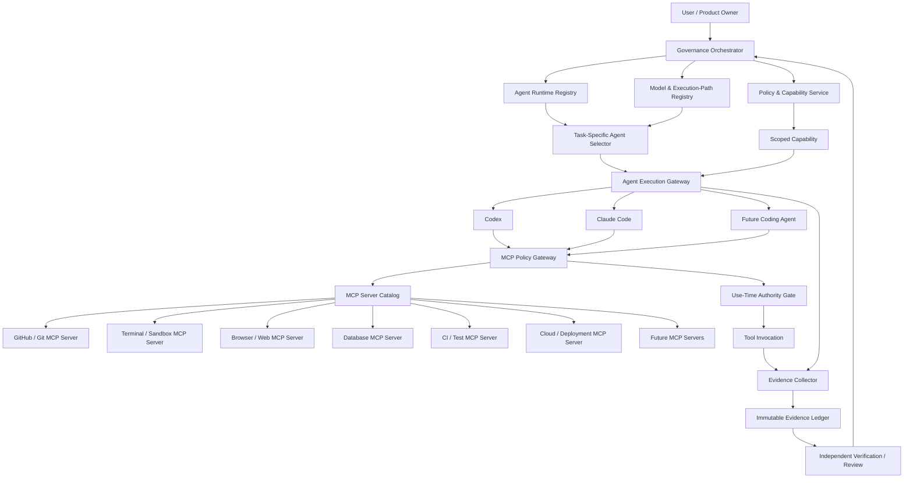

# Governed Platform — Multi-Agent Coding & MCP Tool Fabric Architecture

Status: **Architecture Candidate / Implementation Planning**

This document extends the governed AI development platform so multiple autonomous coding-agent products can participate under one platform-owned governance layer.

Examples include Codex, Claude Code, and future coding agents. These are treated as replaceable **agent runtimes**, not as authority-bearing principals. MCP is used as a standard tool-access fabric where appropriate, but MCP connectivity never bypasses platform policy, qualification, capability, evidence, or release gates.

## 1. Core principle

The platform architecture is:

**Governance owns authority and state. Agents own bounded execution. MCP exposes tools through governed gateways.**

An agent may plan, edit code, run tests, browse, inspect logs, call tools, and continue autonomously within an issued scope. It may not infer a wider scope because the task seems obvious, because another agent approved it, or because an MCP server exposes a powerful tool.

## 2. Agent runtime is distinct from model identity

A coding agent is not equivalent to a model route.

For example:
- Codex may be an agent runtime with its own orchestration, shell/repository behavior, and underlying model route.
- Claude Code may be a different agent runtime with different tool semantics and provider/model lineage.
- A future agent may use one or many models internally.

Therefore the platform maintains two related registries:

### Agent Runtime Registry
Tracks execution products/runtimes such as:
- Codex
- Claude Code
- future coding agents
- internal platform agents
- deterministic non-LLM workers where useful

Recommended identity fields:
- `agent_runtime_id`
- `agent_family`
- `agent_version`
- `provider/operator`
- `adapter_version`
- `supported_task_classes`
- `supported_workspace_modes`
- `supported_tool_protocols`
- `supports_mcp`
- `supports_terminal`
- `supports_repo_write`
- `supports_browser`
- `supports_parallel_workers`
- `underlying_model_visibility` (`KNOWN`, `PARTIAL`, `OPAQUE`)
- `qualification_epoch`
- `operational_status`

### Model & Execution-Path Registry
Tracks model/provider/SKU/deployment/account-path qualification when that identity is observable and material.

The agent-runtime qualification and underlying-model qualification are separate evidence dimensions. A qualified agent product must not automatically qualify every model/path it may later use internally.

## 3. Logical architecture



## 4. Agent Adapter Contract

Every coding agent integrates through a platform adapter. The governance layer must not depend on vendor-specific conversational behavior.

Minimum adapter operations:
- `create_session(execution_envelope)`
- `send_task(context_manifest, task_contract)`
- `grant_tool_channel(tool_channel_ref)`
- `stream_events()`
- `collect_artifacts()`
- `request_stop()`
- `terminate()`

The adapter normalizes agent-native output into platform events rather than allowing vendor-specific states to become authoritative.

Normalized event examples:
- `AGENT_STARTED`
- `PLAN_PROPOSED`
- `TOOL_REQUESTED`
- `TOOL_RESULT_RECEIVED`
- `PATCH_PROPOSED`
- `TEST_REQUESTED`
- `TEST_RESULT_RECEIVED`
- `REVIEW_PROPOSED`
- `TASK_RESULT_PROPOSED`
- `AGENT_BLOCKED`
- `AGENT_FAILED`
- `AGENT_COMPLETED`

`AGENT_COMPLETED` means the runtime ended successfully. It does **not** mean the governed task is complete or releasable.

## 5. Execution envelope

Each agent session receives a platform-issued immutable execution envelope containing at least:

```json
{
  "execution_id": "exec_...",
  "project_id": "project_...",
  "task_id": "task_...",
  "role": "BUILDER",
  "task_class": "CODE_CHANGE",
  "repository_binding": {
    "repository": "owner/repo",
    "base_sha": "...",
    "workspace_id": "workspace_..."
  },
  "agent_runtime_id": "codex-runtime-vX",
  "agent_qualification_ref": "qual_...",
  "model_route_ref": "route_...",
  "policy_hash": "...",
  "capability_ref": "cap_...",
  "context_manifest_hash": "...",
  "mcp_tool_profile_ref": "mcp_profile_...",
  "expires_at": "..."
}
```

The envelope contains references, not raw provider/API credentials.

## 6. MCP as a governed tool fabric

MCP is valuable because it gives heterogeneous agents a common way to discover and invoke tools. But an MCP server is a **tool exposure mechanism**, not an authorization system for the governed platform.

Every agent-facing MCP connection should terminate at or be mediated by a **platform MCP Policy Gateway**.

The gateway is responsible for:
- tool discovery filtering;
- capability-to-tool mapping;
- request validation;
- project/task/workspace binding;
- input validation and policy checks;
- use-time capability revalidation;
- credential leasing/reference resolution;
- side-effect classification;
- rate/quota controls;
- evidence capture;
- response normalization;
- revocation enforcement.

Agents do not receive unrestricted access to every configured MCP server.

## 7. MCP Server Catalog

The platform maintains a registry of allowed MCP servers and tools.

Recommended server fields:
- `mcp_server_id`
- `server_name`
- `server_version`
- `transport`
- `operator`
- `trust_class`
- `auth_profile_ref`
- `data_residency_class`
- `privacy_class`
- `network_scope`
- `enabled`
- `health_status`

Recommended tool fields:
- `tool_id`
- `mcp_server_id`
- `tool_name`
- `tool_version`
- `action_class`
- `artifact_classes`
- `side_effect_class`
- `risk_class`
- `resource_scope_schema`
- `input_schema_hash`
- `output_schema_hash`
- `requires_human_gate`
- `evidence_capture_policy`

## 8. Tool risk and side-effect classes

Suggested side-effect taxonomy:

### `READ_ONLY`
Examples:
- read repository file
- search code
- inspect logs
- query read-only documentation

### `WORKSPACE_MUTATION`
Examples:
- edit files inside isolated worktree
- generate local artifacts
- run formatter

### `EXTERNAL_MUTATION`
Examples:
- push branch
- create/update PR
- modify issue
- change database record
- change cloud configuration

### `RELEASE_OR_PRODUCTION`
Examples:
- merge protected branch
- deploy production
- rotate production secret
- execute irreversible migration

The presence of a tool in MCP discovery never grants permission to invoke it. The current capability must authorize its exact side-effect/action/artifact/resource scope at use time.

## 9. MCP tool profiles

Rather than expose a raw universal tool list, the platform issues a task-specific MCP Tool Profile.

Example Builder profile:
- repository read
- scoped workspace write
- terminal inside sandbox
- dependency documentation search
- unit/integration test runner
- no protected-branch merge
- no production deployment

Example Reviewer profile:
- repository read
- diff read
- CI/test result read
- static-analysis tools
- no production-code write
- no merge/deploy

Example Release operator profile:
- release metadata read
- deployment evidence read
- narrowly scoped release action only after explicit release capability

This makes agent replacement practical: Codex, Claude Code, or another MCP-capable agent can receive the same governed profile even if their internal orchestration differs.

## 10. Credentials and secrets

Agents and MCP servers should not receive broad long-lived platform credentials.

Preferred pattern:
1. Agent requests tool call through MCP Policy Gateway.
2. Gateway verifies current capability.
3. Gateway resolves an internal secret reference or leases a short-lived credential.
4. Tool executes within the requested resource scope.
5. Secret value is never added to the agent context or evidence ledger.
6. Tool result is normalized/redacted before return where needed.

Where a third-party MCP server must hold credentials itself, that server becomes a stronger trust boundary and must be registered with explicit privacy/security metadata.

## 11. Multiple coding agents on one task

The platform supports several patterns.

### Sequential Builder → Reviewer
Example:
- Codex builds.
- Claude Code independently reviews frozen patch/evidence.
- Governor decides whether revision is required.

The reverse pairing must also be independently qualified if used:
- Claude Code builds.
- Codex reviews.

### Parallel independent proposals
Two qualified Builders receive the same frozen contract in separate isolated workspaces.

Rules:
- no shared private reasoning;
- no shared mutable workspace;
- outputs frozen independently;
- comparison/adjudication occurs after both proposals exist;
- winner/merge selection belongs to platform policy, not majority voting.

### Specialist chain
Example:
- Requirements/architecture agent
- coding agent
- test agent
- security reviewer
- release verifier

Each step is separately routed and qualified for its role.

## 12. Workspace isolation and concurrency

Each concurrent Builder gets an isolated workspace/worktree tied to:
- project
- task
- base SHA
- execution ID
- capability

No two agents should mutate the same authoritative working tree concurrently.

A platform-owned integration step handles:
- diff comparison;
- conflict detection;
- invariant validation;
- selected patch application;
- regression evidence;
- new execution SHA creation.

The selected agent cannot simply overwrite another agent's work or merge itself into an authoritative branch.

## 13. Agent qualification

Agent qualification should be role/task-specific just like model qualification.

Example qualification dimensions:
- coding correctness
- requirement preservation
- test quality
- unsafe authority attempts
- tool-use correctness
- secret handling
- repository scope discipline
- rollback/recovery behavior
- false-green tendency
- review sensitivity/specificity
- cost/latency
- MCP protocol/tool reliability

An agent may be qualified as Builder but not Reviewer, or for low/medium-risk code but not security-critical changes.

## 14. Agent selection

The router selects an execution mechanism based on the task contract, not brand preference.

Conceptually:

`eligible_agent = agent_qualified ∧ model/path_qualified_when_required ∧ tool_profile_supported ∧ privacy_compatible ∧ policy_compatible ∧ operationally_available`

Then selection can optimize among eligible candidates for:
- expected quality
- task specialization
- cost
- latency
- current quota
- required tool support
- diversity/independence needs

No globally "best coding agent" is assumed.

## 15. Independence rules for cross-agent review

Codex reviewing Claude Code output or Claude Code reviewing Codex output can add useful diversity, but independence must be measured rather than inferred from product names.

Track separately:
- agent-runtime diversity
- provider diversity
- foundation-model lineage diversity
- execution-path diversity
- shared tool/data dependencies
- shared prior-review exposure

Cross-agent agreement remains evidence only and never creates approval/release authority.

## 16. Evidence requirements for agent and MCP execution

Retain at least:
- execution envelope hash
- agent runtime/version
- observable model/path lineage
- frozen task/context manifest hash
- capability ID/epoch
- MCP server/tool identity and schema version
- normalized tool request hash
- side-effect classification
- use-time authorization decision
- target resource scope
- tool result/effect digest
- workspace/base/result SHA
- tests and verification evidence
- agent final proposed result

Sensitive credentials and secret values are excluded.

## 17. Fail-closed cases

A consequential MCP/tool request is blocked when any of these is true:
- tool not in current MCP profile;
- MCP server/tool version not registered or disabled;
- capability missing/expired/revoked;
- action exceeds capability;
- resource/project/task/workspace mismatch;
- artifact class exceeds scope;
- secret lease unavailable;
- required human gate active;
- tool schema changed without re-approval;
- agent qualification expired/revoked;
- model/path qualification required but stale;
- target is protected/release/production without release authority.

The denied request remains auditable evidence when appropriate.

## 18. Recommended first adapters

Initial agent adapters:
1. Codex adapter
2. Claude Code adapter
3. Generic command/agent adapter for future runtimes

Initial governed MCP/tool integrations:
1. GitHub/Git repository tools
2. isolated terminal/filesystem
3. CI/test runner
4. browser/web research
5. documentation/search

Later:
- issue trackers
- package registries
- cloud platforms
- databases
- observability systems
- security scanners
- design/product tools

## 19. Product boundary

The platform is therefore **not** "one AI coding agent with tools."

It is a governed software-development control plane where many interchangeable agents can operate through common contracts:

**User intent → governed task → qualified agent → scoped capability → governed MCP/tool profile → isolated execution → immutable evidence → independent review → release authority.**

This preserves agent choice while keeping safety, reproducibility, evidence and authority outside every individual agent runtime.
