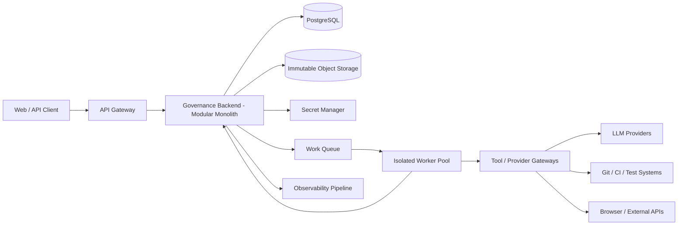

# Governed AI Development Platform — MVP Backend Architecture

Status: **Architecture Candidate / Implementation Planning**

This document translates `ARCHITECTURE.md` into an implementable first backend. The recommended shape is a **modular monolith for authoritative control + isolated execution workers**.

## 1. Deployment topology



The backend owns authoritative state. Workers are disposable executors. Queue contents and worker memory are never authoritative.

## 2. Backend modules

### `contracts`
Owns projects, requirements, invariants, artifact classes, task definitions, risk/materiality metadata and accepted requirement versions.

### `governance`
Owns authoritative workflow state, event acceptance, optimistic state-version transitions, manual gates, completion gates and lifecycle re-entry.

### `policy`
Owns policy versions/hashes, permissible-action decisions, capability issuance, revocation and use-time authorization.

### `registry`
Owns provider/model/SKU/execution-path records, qualification history, role/task/risk/privacy eligibility, foundation lineage, operational availability and quota/capacity state.

### `execution`
Creates immutable execution envelopes, leases scoped credentials/capabilities to isolated workers, and accepts authenticated worker result events.

### `evidence`
Owns canonical evidence envelopes, append-only ledger, content hashes, provenance, admissibility and invalidation.

### `review`
Owns R1/R2/R3 review state, blinding/context construction, review-decision policy, frozen reviewer outputs, adjudication and convergence.

### `memory`
Owns typed memory records and reviewer-stage visibility rules.

### `impact`
Owns artifact dependency graph, accepted change events and transitive evidence invalidation.

### `observability`
Builds user/operator projections from authoritative state and immutable evidence without allowing dashboards to become a source of truth.

## 3. Core PostgreSQL schema

The table names below are conceptual; migrations should retain the same ownership and uniqueness rules.

### Projects and tasks

`projects`
- `project_id` PK
- `name`
- `status`
- `current_contract_version`
- `created_at`

`tasks`
- `task_id` PK
- `project_id` FK
- `task_class`
- `risk_tier`
- `materiality`
- `status`
- `execution_sha`
- `state_version`
- `policy_version`
- `manual_gate_active`
- `completion_authorized`
- timestamps

Uniqueness / locking rule: authoritative task transitions compare `state_version` inside the same transaction that appends the accepted event.

### Requirements and invariants

`contract_versions`
- `project_id`
- `contract_version`
- `content_hash`
- `accepted_by`
- `accepted_at`
- PK (`project_id`, `contract_version`)

`requirements`
- `requirement_id`
- `project_id`
- `contract_version`
- `text_hash`
- `normative_strength`
- `status`

`invariants`
- `invariant_id`
- `project_id`
- `contract_version`
- `semantic_hash`
- `status`

`artifact_dependencies`
- `dependent_artifact_id`
- `dependency_artifact_id`
- `relationship_type`
- `source_evidence_id`
- unique pair + relationship

### Authoritative intents and events

`intent_keys`
- `actor_id`
- `idempotency_key`
- `intent_hash`
- `authoritative_event_id`
- PK (`actor_id`, `idempotency_key`)

`event_ledger`
- monotonically increasing `sequence`
- `event_id` unique
- `project_id`
- `task_id`
- `event_type`
- `source`
- `actor_id`
- `execution_sha`
- `expected_state_version`
- `resulting_state_version`
- `payload_hash`
- `authenticated`
- `created_at`

The accepted idempotency key, event append and task state-version mutation must occur in one PostgreSQL transaction. This promotes the behavior already falsified with `sqlite_authority_store.py` into the product persistence model.

### Policy and capabilities

`policy_versions`
- `policy_id`
- `version`
- `policy_hash`
- `effective_from`
- `revoked_at` nullable
- PK (`policy_id`, `version`)

`capabilities`
- `capability_id` PK
- `project_id`
- `task_id`
- `subject_id`
- `authority_class`
- `allowed_actions` JSONB
- `artifact_classes` JSONB
- `policy_hash`
- `capability_epoch`
- `issued_at`
- `expires_at`
- `revoked_at` nullable
- `issued_by`

Capability rows do not contain provider credentials.

`capability_use_log`
- `use_id` PK
- `capability_id`
- `requested_action`
- `requested_artifact`
- `decision`
- `reason_code`
- `task_state_version`
- `created_at`

A capability is revalidated at each consequential use. A prior successful binding is not a reusable execution authorization.

### Model and execution-path registry

`model_routes`
- `route_id` PK
- `provider`
- `model`
- `sku`
- `deployment_path`
- `execution_path_class`
- `foundation_lineage`
- `privacy_class`
- `enabled`
- `metadata` JSONB

`qualifications`
- `qualification_id` PK
- `route_id` FK
- `role`
- `task_class`
- `risk_tier`
- `policy_hash`
- `qualification_epoch`
- `status`
- `evidence_ref`
- `qualified_at`
- `expires_at`
- `revoked_at` nullable

`route_runtime_state`
- `route_id` PK/FK
- `availability_status`
- `quota_class`
- `quota_remaining` nullable
- `quota_reset_at` nullable
- `capacity_status`
- `last_success_at`
- `last_failure_at`
- `last_error_class`
- `updated_at`

The architecture deliberately separates `qualifications.status` from `route_runtime_state.availability_status`. Quota exhaustion changes operational eligibility, not the retained reasoning qualification.

### Executions

`executions`
- `execution_id` PK
- `project_id`
- `task_id`
- `route_id`
- `qualification_id`
- `policy_hash`
- `capability_id`
- `input_artifact_hash`
- `execution_sha`
- `status`
- `started_at`
- `finished_at`
- `runtime_metadata` JSONB

`execution_attempts`
- `attempt_id` PK
- `execution_id`
- `attempt_no`
- `provider_request_hash`
- `status`
- `error_class`
- `created_at`

Retries remain attempts of one execution identity. They must not silently become different routing paths.

### Evidence

`evidence_records`
- `sequence` BIGSERIAL
- `evidence_id` unique
- `project_id`
- `task_id`
- `execution_id` nullable
- `execution_sha`
- `evidence_type`
- `content_hash`
- `artifact_uri`
- `policy_hash`
- `capability_id` nullable
- `qualification_id` nullable
- `previous_record_hash`
- `record_hash`
- `status` (`CURRENT`, `STALE`, `REVOKED`)
- `created_at`

`evidence_invalidations`
- `invalidation_id` PK
- `evidence_id`
- `reason_type`
- `caused_by_event_id`
- `created_at`

Evidence is never deleted merely because it is no longer admissible. It is retained and marked stale/revoked with causal provenance.

### Reviews

`review_sessions`
- `review_session_id` PK
- `task_id`
- `stage` (`R1`, `R2`, `R3`)
- `route_id`
- `qualification_id`
- `artifact_hash`
- `context_manifest_hash`
- `status`
- `frozen_at` nullable

`review_findings`
- `finding_id` PK
- `review_session_id`
- `failure_class`
- `severity`
- `scope`
- `evidence_id`

`adjudications`
- `adjudication_id` PK
- `task_id`
- `decision`
- `dissent_retained`
- `evidence_manifest_hash`
- `authorized_by`
- `created_at`

### Memory

`memory_records`
- `record_id`
- `project_id`
- `memory_class`
- `version`
- `content_hash`
- `artifact_uri`
- `provenance`
- `source_role`
- `status`
- PK (`record_id`, `version`)

Authoritative memory writes require platform authority. `MODEL_PRIVATE` and `PROTECTED_TRUTH` are denied from reviewer-context construction.

## 4. Canonical command pattern

All consequential API requests become platform commands rather than direct mutations.

Command envelope:

```json
{
  "command_id": "...",
  "actor_id": "...",
  "project_id": "...",
  "task_id": "...",
  "idempotency_key": "...",
  "expected_state_version": 12,
  "command_type": "REQUEST_PATCH_EXECUTION",
  "payload_hash": "sha256:..."
}
```

Processing sequence:
1. authenticate actor/source;
2. validate command schema;
3. deduplicate `(actor_id, idempotency_key)`;
4. lock/load task state;
5. compare state version;
6. run deterministic policy/governance decision;
7. append authoritative event;
8. update task state/version;
9. commit transaction;
10. dispatch non-authoritative work after commit.

No worker/LLM/network call is made while holding the authoritative database transaction open.

## 5. Outbox pattern for safe dispatch

Add `outbox_messages` inside PostgreSQL:
- `message_id`
- `event_id`
- `message_type`
- `payload_hash`
- `payload_uri`
- `status`
- `created_at`
- `published_at`

The same transaction that accepts an authoritative transition inserts the outbox row. A dispatcher publishes it to the queue after commit. This prevents “state changed but work was never queued” and “work queued but state never committed” split-brain failures.

Workers process queue messages idempotently and return authenticated result events. Worker completion does not itself advance authoritative state.

## 6. Execution envelope

A worker receives a frozen envelope containing only what it needs:
- execution ID
- project/task binding
- input artifact digests/authorized content refs
- selected route identity
- qualification ref/epoch
- policy hash
- scoped capability ref
- allowed tool interfaces
- timeout/resource budget
- context manifest hash
- output schema version

Do not include protected truth, unrelated project memory, raw policy internals that are not needed, or long-lived provider credentials.

## 7. Credential model

Workers should obtain short-lived credential leases from a secrets broker after the platform has authorized the execution.

Credential lease properties:
- bound to execution/route where possible;
- short TTL;
- provider/tool-specific;
- never returned to the model prompt;
- never written to evidence/logs;
- revoked when execution terminates where provider supports it.

If provider APIs only support long-lived keys, workers receive them through process environment/secret mounts, and logs/evidence must redact them.

## 8. Model routing transaction

Routing is a read/decision process, not an authority grant.

1. Query qualification candidates by role + task class + risk + privacy + policy.
2. Exclude revoked/expired qualifications.
3. Join current route runtime state.
4. Exclude operationally unavailable routes.
5. Apply reviewer-independence constraints where relevant.
6. Select using versioned routing policy (cost/latency/quality trade-off).
7. Persist the exact route/qualification snapshot on the execution record.
8. Revalidate qualification/path immediately before provider invocation.

If quota changes between selection and invocation, execution fails/re-routes only under the pre-authorized failover policy. A technically successful unqualified substitute is not accepted evidence.

## 9. Capability issuance and use

Capability issuance happens only after diagnosis/policy determines a permissible action.

Example capability:

```json
{
  "capability_id": "cap_...",
  "authority_class": "WRITE_SCOPED_ARTIFACT",
  "project_id": "p1",
  "task_id": "t8",
  "subject_id": "worker:execution-123",
  "allowed_actions": ["WRITE"],
  "artifact_classes": ["production_code"],
  "policy_hash": "sha256:...",
  "capability_epoch": 4,
  "expires_at": "..."
}
```

If the model emits `authorized_scope=["release"]`, this is stored as a behavioral claim. It never changes the capability row or effective authority.

Immediately before a write/deploy/release/external action, the gateway verifies:
- capability exists;
- subject matches;
- task/project matches;
- current capability epoch matches;
- not revoked/expired;
- policy binding is current;
- requested action is allowed;
- requested artifact/resource is in scope;
- task state still permits the action.

## 10. Evidence transaction

Evidence creation should use an immutable blob + ledger pattern:
1. canonicalize output/artifact;
2. hash content;
3. upload immutable blob using content-addressed key;
4. insert evidence ledger row with previous-record hash;
5. link evidence to execution/task/project;
6. never overwrite the blob for the same digest;
7. subsequent invalidation changes admissibility metadata, not historical content.

High-value evidence types:
- requirements/contract snapshot
- input artifact snapshot
- model output
- diff/patch
- test report
- CI/workflow result
- static/security analysis
- runtime execution log
- independent review
- human approval/decision
- capability decision/use event
- qualification snapshot

## 11. Review context manifest

Every reviewer receives a content-addressed context manifest listing exactly which records/artifacts were visible.

Manifest example fields:
- reviewer stage
- task/artifact hash
- authoritative requirement version
- included project/working memory IDs + versions
- included prior review evidence IDs (normally none before staged disclosure)
- explicitly excluded memory classes
- policy hash
- context manifest hash

The manifest is evidence. This lets us later prove whether reviewer disagreement could be caused by context drift.

## 12. Release/complete state machine

Recommended task states:

`DRAFT → DIAGNOSING → READY_TO_EXECUTE → EXECUTING → VERIFYING → REVIEWING → READY_FOR_GATE → COMPLETE`

Side states:
- `BLOCKED`
- `HUMAN_REQUIRED`
- `REQUIREMENT_UNRESOLVED`
- `CANCELLED`

`COMPLETE` requires:
- current required evidence set complete;
- no blocking unresolved finding;
- all evidence provenance current;
- required review stages complete;
- release/completion policy satisfied;
- explicit external completion authority where policy requires it.

A green provider call, test run, CI run, or unanimous reviewers cannot directly set `COMPLETE`.

## 13. MVP API surface

Initial commands:
- `POST /projects`
- `POST /projects/{id}/contracts`
- `POST /tasks`
- `POST /tasks/{id}/diagnose`
- `POST /tasks/{id}/executions`
- `POST /tasks/{id}/events`
- `POST /tasks/{id}/reviews`
- `POST /tasks/{id}/human-decisions`
- `POST /tasks/{id}/complete`

Read models:
- `GET /projects/{id}`
- `GET /tasks/{id}`
- `GET /tasks/{id}/timeline`
- `GET /tasks/{id}/evidence`
- `GET /tasks/{id}/authority`
- `GET /registry/routes`
- `GET /registry/routes/{id}`
- `GET /audit/events`

Mutation APIs return the resulting authoritative state version and event ID.

## 14. First implementation slices

### Slice 1 — Authoritative task/event core
PostgreSQL task state, idempotency table, event ledger, transaction/CAS rules, outbox and deterministic governor.

### Slice 2 — Evidence core
Immutable object storage, evidence ledger, evidence manifest and invalidation.

### Slice 3 — Registry/routing core
Persistent routes + qualifications + runtime availability/quota state; bind provider/model/SKU/path.

### Slice 4 — Capability core
Capability issuer/store, revocation, binding and use-time authorization.

### Slice 5 — Execution worker
One isolated provider/tool worker receiving frozen execution envelopes and returning authenticated evidence events.

### Slice 6 — Review workflow
R1/R2/R3 durable review sessions, context manifests and adjudication.

### Slice 7 — Operator/user dashboard
Show workflow state, evidence status, route identity, quota/availability, current gate and why a task is blocked/complete.

## 15. Security boundary rule

The governance backend, PostgreSQL authoritative state and capability service form the trusted control plane. Execution workers, LLM providers, model outputs, mutable repositories, browsers, CI systems and external tool responses are outside that trusted boundary and must be treated as untrusted evidence/action sources.
