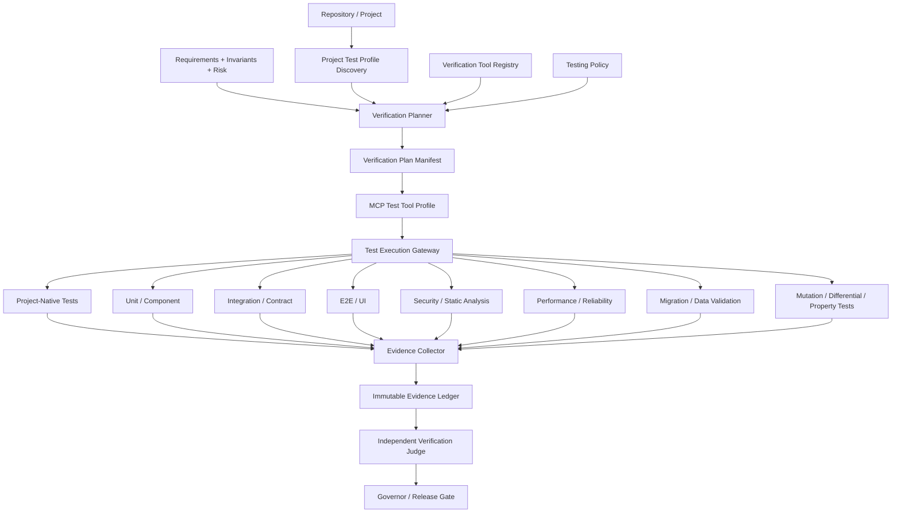

# Governed Platform — Adaptive Testing & Verification Architecture

Status: **Architecture Candidate / Implementation Planning**

This document defines how the governed platform chooses, runs, and evaluates testing mechanisms across heterogeneous software projects. The platform owns the verification policy. Coding agents may propose tests or frameworks, but they do not decide what evidence is sufficient for approval.

## 1. Core decision

Testing framework selection is **project-aware and platform-governed**.

The platform should not hard-code one global test framework, and it should not let Codex, Claude Code, or another Builder silently choose a framework based on preference. Instead it builds a versioned **Project Test Profile**, queries a qualified **Verification Tool Registry**, and produces a **Verification Plan Manifest** appropriate to the task, risk, artifact, and existing repository conventions.

Default rule:

> Preserve the project's existing qualified testing stack when it adequately covers the required verification layer. Add or replace tools only when evidence shows a material coverage, compatibility, reliability, security, or maintainability gap.

## 2. Separation of responsibilities

### Builder agent
May:
- inspect existing tests;
- add or update tests within granted scope;
- recommend an additional test mechanism;
- run permitted project-native tests;
- report evidence and failures.

May not:
- declare its own tests sufficient for release;
- delete or weaken protected acceptance tests to make implementation pass;
- silently replace the project's testing stack;
- alter authoritative test requirements or acceptance oracles;
- classify a failing verification mechanism as defective without governed diagnosis.

### Verification Planner
Platform-owned component that decides:
- which verification layers are required;
- which qualified tools/frameworks may satisfy each layer;
- whether the existing project-native framework is sufficient;
- whether an independent complementary verifier is required;
- whether a framework/tool change requires human approval.

### Test/Verifier agent
May generate or execute test artifacts according to the frozen plan, but its output remains evidence rather than approval authority.

### Governor / Release Gate
Determines whether the current evidence set satisfies the task's verification contract.

## 3. Logical architecture



## 4. Project Test Profile

The platform discovers the project's existing testing environment before deciding what to use.

Recommended profile fields:
- primary languages;
- application frameworks;
- package/build systems;
- existing test frameworks and versions;
- existing CI test commands;
- test directory conventions;
- unit/component/integration/E2E coverage mechanisms;
- API/contract testing mechanisms;
- mobile/web/desktop runtime targets;
- database/data-migration stack;
- security/static-analysis tools;
- performance/load tools;
- container/test-environment support;
- hardware/emulator/device requirements;
- current test health/flakiness evidence;
- historical execution time;
- protected acceptance tests;
- fixture/test-data ownership;
- required external services;
- applicable project policy.

Discovery is evidence, not automatic authority to edit configuration.

## 5. Verification Tool Registry

Testing frameworks and verification tools are registered separately from coding agents.

A tool/framework record should include:
- `verification_tool_id`;
- name and version;
- language/runtime compatibility;
- supported verification layers;
- execution adapter/MCP tool identity;
- environment requirements;
- side-effect class;
- deterministic/reproducibility characteristics;
- known flakiness profile;
- setup cost;
- runtime/cost observations;
- project compatibility rules;
- security/privacy constraints;
- qualification evidence reference;
- qualification epoch/expiry;
- operational availability;
- maintenance status.

Examples may include project-native mechanisms such as pytest, JUnit, flutter_test, Vitest/Jest, Playwright, Cypress, XCTest, Espresso, Robot Framework, Postman/Newman, contract-test tools, Testcontainers, static analyzers, security scanners, property-based tools, mutation tools, and future mechanisms. None is globally preferred merely because it is popular.

## 6. Framework-selection policy

Selection is constraint-first, then optimization.

### Hard eligibility constraints
A candidate mechanism must be:
- compatible with the project's language/runtime;
- qualified for the required verification layer;
- compatible with current privacy/security policy;
- executable in the available sandbox/environment;
- supported by a current adapter/MCP tool path;
- operationally available;
- able to produce admissible evidence;
- non-conflicting with protected project constraints.

### Preference order
Among eligible choices, prefer:
1. existing healthy project-native framework;
2. existing qualified complementary framework already configured;
3. lowest-change qualified addition that closes a known verification gap;
4. a new framework only when materially justified.

### Optimization factors
The platform may then consider:
- defect-detection evidence for this project/task class;
- independence/complementarity;
- reliability/flakiness;
- execution latency;
- cost;
- setup/maintenance burden;
- ecosystem compatibility;
- developer familiarity where known;
- CI/runtime resource needs.

Popularity alone is not a decision rule.

## 7. Verification layers are selected independently of framework brands

The planner reasons first about **what must be verified**, then about the tool.

Possible layers:
- compile/build/type checking;
- lint/static correctness;
- unit behavior;
- component/widget behavior;
- integration behavior;
- API/contract behavior;
- database/migration behavior;
- end-to-end/UI behavior;
- mobile device/emulator behavior;
- accessibility;
- security/dependency/static analysis;
- permissions/authentication/authorization;
- concurrency/idempotency/replay behavior;
- performance/load/resource behavior;
- resilience/failure recovery;
- property-based/metamorphic testing;
- mutation/differential testing;
- manual QA where machine verification cannot establish the requirement.

Not every task requires every layer. Risk, materiality, changed artifacts, dependency graph, and authoritative requirements drive selection.

## 8. Example decisions

These are examples, not hard-coded rules.

### Existing Flutter application
If the repository already has healthy `flutter_test` and integration-test infrastructure, preserve it for widget/unit/integration coverage. Add another mechanism only when a requirement needs something it cannot establish, such as device-specific manual validation, API contract verification, or security analysis.

### Python backend
If pytest is already healthy and qualified, use it rather than introducing another unit framework. For database/integration behavior, the planner might additionally require isolated database/container execution or contract verification.

### TypeScript web application
If the project already uses a healthy unit framework and Playwright for E2E, keep them. A Builder cannot replace them simply because it prefers another framework.

### Legacy project with no test infrastructure
The platform may recommend a framework based on runtime compatibility, project constraints, internal qualification evidence, maintenance cost and required test layers. Introducing the new framework is a governed project change, not an invisible agent preference.

## 9. Verification Plan Manifest

Before evidence can satisfy a gate, the platform creates a versioned manifest such as:

```json
{
  "verification_plan_id": "vp_...",
  "project_id": "project_...",
  "task_id": "task_...",
  "base_sha": "...",
  "contract_version": 12,
  "risk_tier": "HIGH",
  "changed_artifact_classes": ["production_code", "api_contract"],
  "required_layers": [
    "BUILD",
    "UNIT",
    "API_CONTRACT",
    "INTEGRATION",
    "SECURITY_AUTHZ",
    "REGRESSION"
  ],
  "selected_tools": [
    {"tool_ref": "project-native-unit", "qualification_epoch": 4},
    {"tool_ref": "contract-verifier", "qualification_epoch": 2}
  ],
  "protected_evidence_refs": ["acceptance_contract_v12"],
  "independent_verification_required": true,
  "policy_hash": "..."
}
```

The manifest is immutable for that execution attempt. Material changes create a new plan/version rather than silently rewriting the old evidence requirement.

## 10. Builder tests vs acceptance evidence

The architecture distinguishes:

### Builder-generated tests
Useful evidence that the implementation author created to demonstrate behavior. These may be modified by the Builder within scoped authority.

### Project regression tests
Existing project tests that should normally remain stable except under evidence-backed change.

### Protected acceptance tests/oracles
Tests or requirements whose purpose is to independently determine whether the implementation satisfies authoritative intent. A Builder must not be able to modify these as part of fixing production code.

### Independent verification tests
Generated or run by a separate qualified verifier/test agent or deterministic mechanism after the Builder output is frozen.

This prevents a common false-green path: implementation and test being changed together until they agree with each other while both disagree with the requirement.

## 11. Testing through MCP

Testing tools fit naturally into the governed MCP fabric.

Example MCP tools:
- inspect test configuration;
- run named unit suite;
- run integration environment;
- execute emulator/device test;
- run contract verifier;
- run security scanner;
- collect coverage;
- collect test reports;
- provision disposable database/container;
- retrieve CI evidence.

The task-specific MCP Test Profile exposes only tools required by the frozen Verification Plan.

Running a read-only test is generally lower risk than changing dependencies/configuration. Installing a new framework, altering CI, modifying test infrastructure, updating fixtures, or changing protected tests is a mutation and requires corresponding platform-issued authority.

## 12. Independent verifier selection

For material/high-risk changes, verification should not rely solely on the same agent that built the change.

The platform may route:

`Codex Builder -> deterministic project tests -> Claude Code Test/Review agent -> security verifier -> release gate`

or

`Claude Code Builder -> deterministic tests -> Codex independent verifier`

The particular brands are not important. The selected verifier must be qualified for the verification role and sufficiently independent under the project's policy.

A deterministic test framework can itself provide independent evidence even when the Builder invokes it, provided the Builder cannot alter its authoritative oracle and the evidence provenance is protected. Model-based review adds another complementary mechanism; it does not replace deterministic tests where those are applicable.

## 13. Failure classification remains governed

When a test fails, the Builder must not automatically edit whatever is easiest.

The platform enters evidence-based diagnosis:
- `CODE DEFECT`
- `FIXTURE-DATA DEFECT`
- `TEST DEFECT`
- `ENVIRONMENT-TOOLING DEFECT`
- `REQUIREMENT UNRESOLVED`

Only after classification does the platform issue corrective scope for the appropriate artifact class.

This protects against agents weakening tests, fixtures, CI, or requirements simply to turn a red run green.

## 14. Framework changes

Changing or introducing a test framework is a first-class project change when it affects dependencies, CI, team workflow, test semantics, or maintenance burden.

Automatic introduction may be permitted for low-risk disposable verification tools in an isolated verification workspace when they do not modify the project artifact.

Persistent framework adoption should require stronger evidence and, depending on project policy/materiality, human approval.

The platform records:
- reason for change;
- alternatives evaluated;
- compatibility evidence;
- migration impact;
- maintenance implications;
- affected CI/configuration;
- whether old test evidence becomes stale;
- approval identity when required.

## 15. Test framework qualification is evidence-based

A tool is not qualified simply because it is widely used.

Internal qualification should measure relevant properties such as:
- correctness of result parsing;
- reproducibility;
- failure/exit-code semantics;
- handling of timeouts;
- artifact/report integrity;
- compatibility with sandboxing;
- ability to bind results to exact SHA/workspace;
- resistance to test-result spoofing;
- behavior under partial/infrastructure failure;
- adapter/MCP evidence fidelity.

Qualification is scoped by version and execution path where material.

## 16. Coverage is a signal, not proof

Code/test coverage metrics can identify unexercised surfaces, but a high percentage does not prove requirement correctness.

The platform must not allow coverage percentage to override:
- missing acceptance behavior;
- semantic requirement contradictions;
- known untested invariants;
- failed independent verification;
- security/manual gates.

Likewise, a green test suite is evidence, not automatic release authority.

## 17. Recommended first product implementation

### Phase 1 — Project Test Profile Discovery
Detect existing frameworks, commands, CI, test layers and protected acceptance artifacts without changing the repository.

### Phase 2 — Verification Tool Registry
Register project-native and platform-provided test mechanisms with versions, layer capabilities, qualification, operational status and adapter/MCP path.

### Phase 3 — Verification Planner
Input:
- authoritative task/requirements;
- changed artifact classes;
- risk/materiality;
- dependency/impact graph;
- Project Test Profile;
- qualified Tool Registry.

Output: frozen Verification Plan Manifest.

### Phase 4 — Test Execution Gateway
Expose the selected verification tools through the governed MCP/tool gateway and isolated workers.

### Phase 5 — Evidence normalization
Convert every test result into canonical provenance-bound evidence tied to exact task, SHA, environment, tool/version and plan.

### Phase 6 — Independent verification routing
For policy-required tasks, select an independent Test Judge/Reviewer rather than allowing Builder self-certification.

### Phase 7 — Release evidence gate
The Governor verifies that every required current verification layer has admissible evidence before considering completion/release.

## 18. Final architecture principle

The platform therefore decides **testing strategy**, while frameworks remain interchangeable mechanisms.

The desired sequence is:

**Understand project -> understand change/risk -> determine required verification layers -> preserve adequate existing tools -> select qualified complementary tools -> freeze verification plan -> Builder executes -> independent verification -> evidence gate -> release decision.**

This lets the platform support Flutter, Python, JavaScript/TypeScript, Java, .NET, mobile, backend, data, infrastructure and future stacks without hard-coding one testing technology or delegating verification authority to whichever coding agent happens to be running.